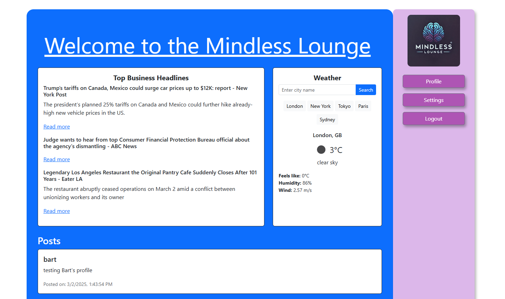

# The Mindless Lounge


## Table of Contents

- [Project Overview](#project-overview)
- [Features](#features)
- [Technologies Used](#technologies-used)
- [Installation](#installation)
- [Usage](#usage)
- [Deployment](#deployment)
- [Future Enhancements](#future-enhancements)
- [Contributors](#contributors)
- [License](#license)

## Project Overview

The Mindless Lounge is a social media platform where users can share their thoughts in real-time and engage with posts from other users on their personalized feed. Designed to be a simple and intuitive way to express oneself without barriers, this application fosters spontaneous and free-flowing digital interactions.

## Features

- RESTful API: Built with Node.js and Express.js for seamless backend communication.

- Modern Front-End: Developed using React to deliver a dynamic and responsive user experience.

- Database Integration: Uses PostgreSQL with Sequelize ORM for efficient data handling.

- User Authentication: Secure JWT-based authentication for user access management.

- Server-Side APIs: Incorporates at least two external APIs to enhance functionality.

- Environment Variables: Ensures security by protecting API keys and sensitive data.

- Deployment: Live application deployed on Render with full database integration.

- Polished UI: A sleek and intuitive user interface designed for seamless navigation.

- Interactive Experience: Application dynamically responds to user input and interactions.

## Technologies Used

- Backend: Node.js, Express.js, PostgreSQL, Sequelize ORM

- Frontend: React, React Router, Bootstrap/Reactstrap

- Authentication: JSON Web Tokens (JWT)

- APIs: Integration of at least two server-side APIs

- Version Control: Git, GitHub

- Deployment: Render (for both frontend and backend)

## Installation

### Prerequisites

Ensure you have the following installed on your system:

1. Node.js

2. PostgreSQL

3. Git

### Setup

Clone the Repository:

```
   git clone https://github.com/pojoto4/mindlessLounge.git
```

Navigate to Project Directory:

```
   cd the-mindless-lounge
```

Install Dependencies:

```
   npm install
```

Set Up Environment Variables:

```
Create a .env file and add the required API keys and database credentials.
```

Start the Application:

```
npm start
```

## Usage

Once the application is running, navigate to http://localhost:3000 to access the frontend interface. Users can sign up, log in, and post their thoughts.

## Deployment

This application is deployed on Render and can be accessed at: https://mindlesslounge.onrender.com


## Future Enhancements:

- Implement additional user roles and permissions.

- Enhance UI with animations and improved accessibility features.

- Expand API integrations for greater functionality.

- Optimize database queries for improved performance.

## Contributors

This project was developed by:

- Justin D
- Shauna D
- Joe M
- Sydney S

## License

This project is licensed under the MIT License.

For more information, visit our GitHub Repository: https://github.com/pojoto4/mindlessLounge
